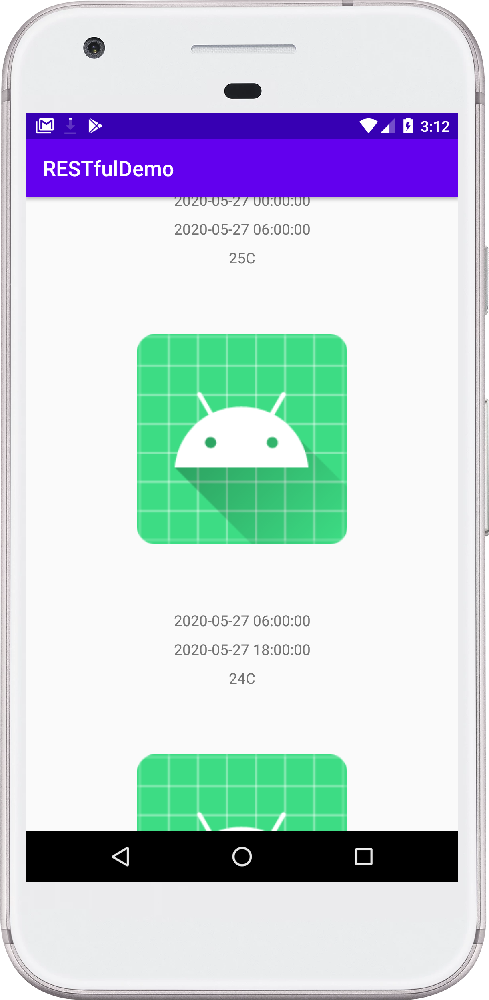
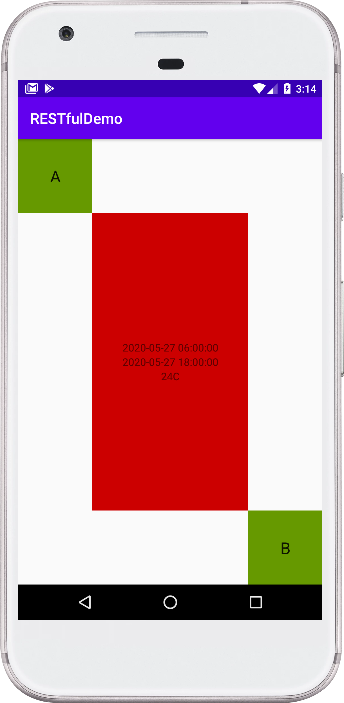
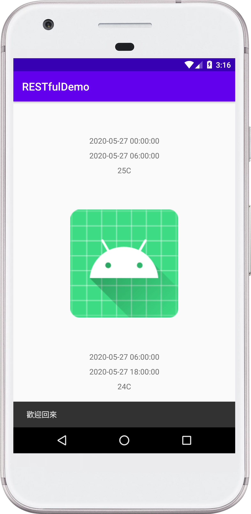

# RESTful_Demo

 
 

此Demo將使用[中央氣象局開放資料平台API](https://opendata.cwb.gov.tw/index)內的 **36小時天氣預報資料** (F_C0032_001)，搭配條件：台北市、Mint，以獲取台北市36小時氣象預報等天氣資訊，接著透過解析API回傳的氣象資訊Json資料，得到最低溫度（MinT）

並在每筆氣象資料(type_A)之間插入一張任意圖片(type_B)。點擊 type_A 可跳至下一頁，該頁面將會顯示此筆資料的數據；點擊 type_B 則不做任何動作。

所有頁面皆使用 ConstraintLayout 實現以達成各種螢幕尺寸自適應、不跑版的目的。

關閉App後，再次啟動（第二次開啟）時將透過 ~~Toast~~ SnackBar(Material Design推薦元件) 顯示「歡迎回來」歡迎詞。

**Demo使用SnackBar元件做相關資訊的顯示，但仍保留Toast實現的程式碼，僅註解掉。**

 
 

## 這個Demo使用到以下功能:

| 實作項目 | 功能描述 |
| --- | --- |
| RecycleView | 顯示三十六小時天氣預報資訊清單的元件 |
| OKHttp | 一個高效的Http連線第三方函示庫 |
| Gson | 用來解析Json的第三方函式庫 |
| [Constraintlayout*](https://developer.android.com/reference/androidx/constraintlayout/widget/ConstraintLayout) | Android的各種尺寸、不同螢幕解析度、不同螢幕密度的介面自適應佈局功能，類似 iOS的 AutoLayout概念。 |
| [ViewModel*](https://developer.android.com/topic/libraries/architecture/viewmodel) | 一個 [具有生命週期感知的元件](https://developer.android.com/topic/libraries/architecture/lifecycle) |
| [LiveData*](https://developer.android.com/topic/libraries/architecture/livedata)| 一個 [具有生命週期感知的元件](https://developer.android.com/topic/libraries/architecture/lifecycle)並可觀察的資料類型 |
| [SharedPreferences](https://developer.android.com/reference/android/content/SharedPreferences) | 一個輕量化的本地數據儲存方式 |

*星號表示這個功能或函式庫是屬於 [Android Architecture Components](https://developer.android.com/topic/libraries/architecture) - [Android Jetpack](https://developer.android.com/jetpack) 的一部分。

 
 

這個專案使用 [AndroidX相容包函式庫](https://developer.android.com/jetpack/androidx)

 
 
 
 

  

 
 

